# Log Processing Rules
As part of log ingestion pipeline, Log Processing allows us to transform incoming log record data for better understanding or analysis.

Some common situations in which log processing rules are use
- To define searchable custom attributes 
- To Manipulate attributes (fields) from log records.
- To perform basic math on attributes 
- To Drop or mask log record attributes or entire log records (like we are doing with Fluent bit log ingestion.)
- To Parse log records to extract new attributes

With Log Processing, we can process all logs sent to Dynatrace cluster. Numerical attributes, strings, dates, IP-addresses, arrays,objects and other data can be extracted as fields from raw log records. This allows creating metrics or events based on extracted fields, conduct troubleshooting, include these in Davis root cause, ...

Log Processing in Dynatrace is done through log processing rules. All processing rules that match a log record are applied from top to bottom. The output from one rule is an input for the next one.

Log Processing rules consist in name, a matcher (which defines the scope of log records to be processed) and a(which defines the processing to be done on the different fields of the subset of matching records).

<br/>

## Log Processing Rule Definition
A processing Rule definition consists of a left-to-right sequence of processing commands chained together using the pipe character. 

<br/>

### Available Log Processing Commands
The following commands are available to be used in :

<br/><br/>**USING()**: Specifies the input to a given transformation by listing fields with options that can be passed from the incoming event to the transformation. This command must be the first command used in the .

Syntax:`USING([IN|INOUT] <field_name>: [type[]?])`
· **`IN`**: Read-only field (default option).
· **`INOUT`**: Writable field.
· **`type`**: Data type`STRING, BOOLEAN, INTEGER, LONG, DOUBLE, DURATION, TIMESTAMP, IPADDR`)
· **`[]`**: Marks a field as an array.
· **`?`**: Marks the field as optional.

Please check the example below
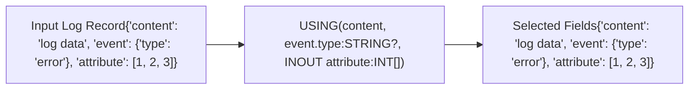


<br/><br/>**PARSE()**: Parses the selected field with a provided pattern expression, enhancing the log record with exported values.

Syntax `PARSE(<field_name>, "<DPL_EXPRESSION>")`

Please check the example below:
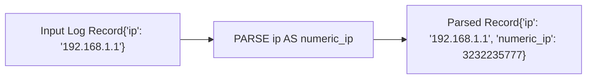


<br/><br/>**FIELDS_ADD()**: Enriches the record with additional fields by computing expressions.

Please check the example below:
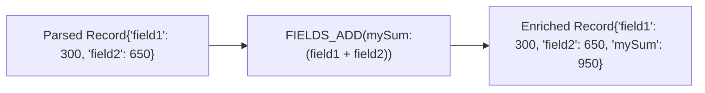


<br/><br/>**FIELDS_RENAME**: Renames specified fields of a record while preserving field order and other fields.

Please check the example below
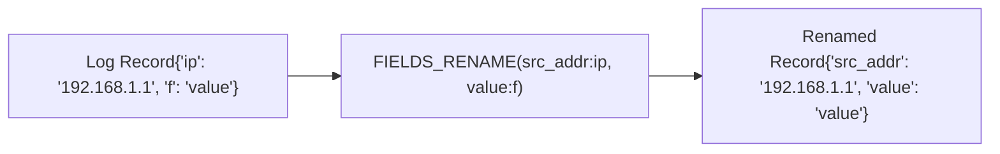


<br/><br/>**FIELDS_REMOVE**: Removes specified fields from the output stream.

Please check the example below
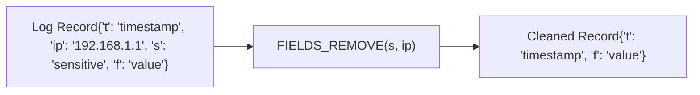


<br/><br/>**FILTER_OUT**: Discards the whole record using an expression returning a boolean value.

Please check the example below
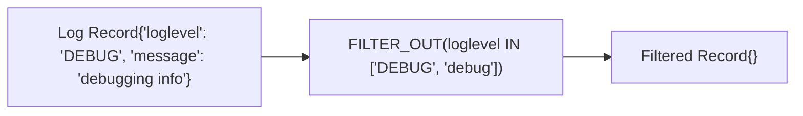

<br/>

## Log Processing Rule Functions
Log Processing commands define the overall structure and actions to be taken on log data, while **functions** are used within those commands to perform specific operations and calculations. Function are used to compute values, perform transformations, and apply logic within the context of commands.
The following type of functions are available as parameters to the commands:

<br/><br/>**Bitwise operations** Bitwise operations manipulate individual bits. Functions include `BITWISE_AND(numeric_expr1, numeric_expr2)` for bitwise AND, `BITWISE_OR(numeric_expr1, numeric_expr2)` for bitwise OR, `BITWISE_XOR(numeric_expr1, numeric_expr2)` for bitwise XOR, and `LEFT_SHIFT(numeric_expr1, numeric_expr2)` for shifting bits left.

Please check an example below
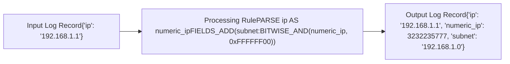


<br/><br/>**Boolean** Boolean functions perform logical operations. `AND(boolean_expr1, boolean_expr2)` returns true if both are true, `OR(boolean_expr1, boolean_expr2)` returns true if either is true, `XOR(boolean_expr1, boolean_expr2)` returns true if only one is true, and `NOT(boolean_expr)` negates the boolean value.

Please check an example below
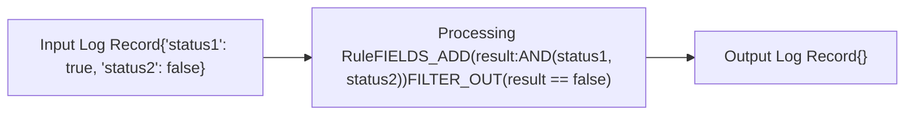

<br/><br/>**Casting** Casting functions convert data types. `BOOLEAN(string)` converts a string to boolean, `BYTES(string)` converts a string to bytes, `DOUBLE(numeric_expr)` converts a number to double, and `INTEGER(string)` converts a string to integer.

Please check an example below
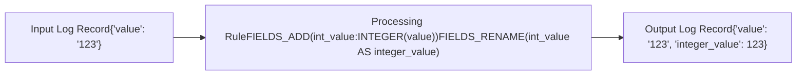

<br/><br/>**Comparison** Comparison functions compare values. `EQUALS(value1, value2)` checks for equality, `GREATER_THAN(value1, value2)` checks if one value is greater, `LESS_THAN(value1, value2)` checks if one value is less, and `NOT_EQUALS(value1, value2)` checks for inequality.

Please check an example below
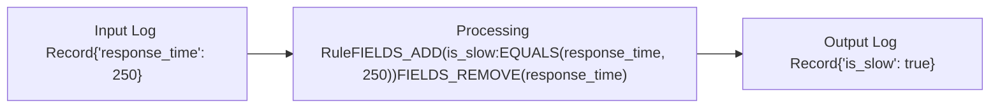

<br/><br/>**Composite-data** Composite-data functions handle arrays and objects. `ARRAY_CONTAINS(array, value)` checks if an array contains a value, `ARRAY_LENGTH(array)` returns the array’s length, `OBJECT_GET(object, key)` retrieves a value by key, and `OBJECT_KEYS(object)` returns the keys of an object.

Please check an example below
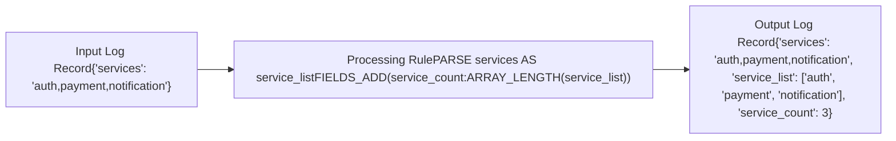


<br/><br/>**Cryptographic** Cryptographic functions perform hashing. `MD5(value)` computes an MD5 hash, `SHA1(value)` computes a SHA-1 hash, `SHA256(value)` computes a SHA-256 hash, and `HMAC(key, message)` generates a keyed-hash message authentication code.

Please check an example below
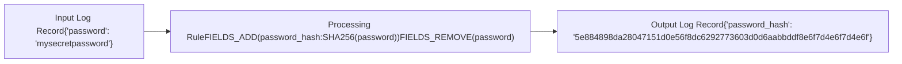

<br/><br/>**Date-time** Date-time functions manage dates and times. `NOW()` returns the current timestamp, `DATE_ADD(date, duration)` adds a duration to a date, `DATE_DIFF(date1, date2)` calculates the difference between dates, and `FORMAT_DATE(date, pattern)` formats a date.

Please check an example below
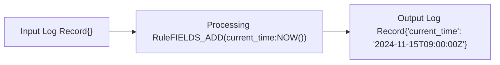


<br/><br/>**Flow-control** Flow-control functions manage execution flow. `IF(condition, true_value, false_value)` executes based on a condition, `SWITCH(value, case1, result1, case2, result2, default)` handles multiple conditions, `WHILE(condition, action)` repeats an action while a condition is true, and `FOR(variable, start, end, action)` iterates over a range.

Please check an example below
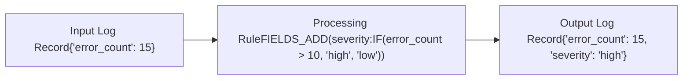

<br/><br/>**Math** Math functions perform arithmetic. `ADD(a, b)` adds two numbers, `SUBTRACT(a, b)` subtracts one number from another, `MULTIPLY(a, b)` multiplies two numbers, and `DIVIDE(a, b)` divides one number by another.

Please check an example below
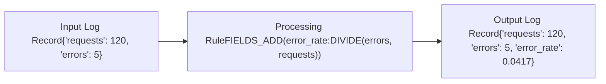

<br/><br/>**Network** Network functions handle IP addresses. `IP_TO_STRING(ip)` converts an IP to a string, `STRING_TO_IP(string)` converts a string to an IP, `IP_IN_SUBNET(ip, subnet)` checks if an IP is within a subnet, and `IP_RANGE(start_ip, end_ip)` generates a range of IPs.

Please check an example below
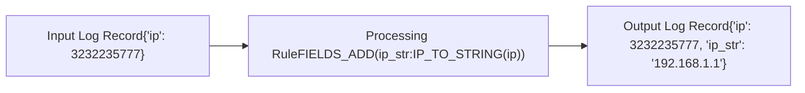

<br/><br/>**Strings** String functions manipulate text. `CONCAT(string1, string2)` joins strings, `SUBSTRING(string, start, length)` extracts a substring, `LENGTH(string)` returns the string’s length, and `REPLACE(string, old_substring, new_substring)` replaces substrings.

Please check an example below
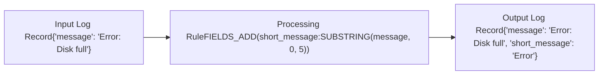

<br/><br/>**Other** Miscellaneous functions include `UUID()` for generating unique identifiers, `RANDOM()` for random numbers, `BASE64_ENCODE(value)` for encoding in Base64, and `BASE64_DECODE(value)` for decoding Base64 strings.

Please check an example below
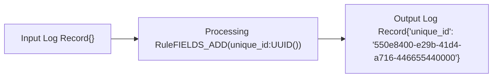


A comprehensive list of functions and parameters can be found [here](https://dt-url.net/processing-rules-functions).

*It is important to note that functions and operators accept only declared types of data. The type is assigned to all input fields defined by the USING command as well as to the variables created while parsing or using the casting functions*

<br/><br/>

# The importance of DPL in Log Processing Rules
One of the most typical use cases of log processing rules is to extract data from log record fields into new fields or to create metrics or events based on the extracted data. 

Extracting data from log records is done by using the `PARSE` command, which takes as parameters the field that we want to parse and a string with a pattern that describes the data we want to extract.

Patterns are described using the Dynatrace Pattern Language, which is a powerful way to describepatterns using matchers.

A DPL pattern consists of one or more matcher expressions. They can be separated by whitespace or commas or newlines. For a handy reference guide to all matchers, see the [DPL Grammar page](https://docs.dynatrace.com/docs/platform/grail/dynatrace-pattern-language/log-processing-grammar "Complete grammar list of Dynatrace Pattern Language syntax.").

A matcher is a mini-pattern that matches a certain type of data. For example, INTEGER (or INT) matches integer numbers, and IPADDR matches IPv4 or IPv6 addresses. There are matchers available to handle all kinds of data types.

A written pattern is interpreted from left to right, ignoring extra whitespaces, line breaks, and comments in betweenm

To better understand DPL matching, check the example below where we have some log records. Each log records resembles a csv file entry where we have a timestamp field and a content field. In the content field we have a text string with the sequence number, the username and an IP address (all separated )

![[Pasted image 20241114095751.png]]

We can use an `INT` matcher to match the sequence number, then we use a string literal matcher to match the comma `,` then we can match the name with either `WORD` or `LD` patterns, again we can match the comma and finally the Ip address with `IPADDR`.

So with the following simple DPL string we can match every mini-pattern in the content field.
`INT ',' LD ',' IPADDR`


DPL can be used to match your data in a flexible way and to extract it to new fields by appending an [export name](https://docs.dynatrace.com/docs/platform/grail/dynatrace-pattern-language/log-processing-modifiers#exportname "Explore Dynatrace Pattern Language syntax for optional controlling elements (modifiers).") - this is an arbitrary name of your choice, which becomes the name of the field you use in query statements. You can add `:fieldname` to the matcher if you want to store the extracted data into a new field.

So we can use `INT:id ',' LD:name IPADDR:ip` to extract the values as new fields
![[Pasted image 20241114102638.png]]

Please also check the following example which has 11 matchers in total out of which 4 matchersare extracting data
![[dpl-ref-2133-49fd05dd03 1.png]]
## Available matchers
The Dynatrace Pattern Language (DPL) offers a comprehensive set of matchers to help you process and analyze log data effectively. Here’s a summary of all the matchers available:

- **ENUM**: Matches enumeration values.
- **JSON**: Matches JSON objects.
- **JSON_ARRAY**: Matches JSON arrays.
- **JSON_VALUE**: Matches JSON values.
- **KVP**: Matches key-value pairs.
- **ARRAY**: Matches arrays.
- **STRUCTURE**: Matches structured data.
- **DATA**: Matches multiline data.
- **LDATA /LD**: Matches line data.
- **Alternatives Group**: Matches one of several patterns.
- **Sequence Group**: Matches a sequence of patterns.
- **EOL**: Matches the Line Feed character.
- **EOLWIN**: Matches Line Feed and Carriage Return characters.
- **CR**: Matches the Carriage Return character.
- **UPPER**: Matches uppercase characters.
- **LOWER**: Matches lowercase characters.
- **ALPHA**: Matches alphabetic characters.
- **DIGIT**: Matches digits.
- **XDIGIT**: Matches hexadecimal digits.
- **ALNUM**: Matches alphanumeric characters.
- **PUNCT**: Matches punctuation and symbol characters.
- **BLANK**: Matches space and tab characters.
- **SPACE**: Matches whitespace characters.
- **NSPACE**: Matches non-whitespace characters.
- **GRAPH**: Matches visible characters.
- **PRINT**: Matches printable characters.
- **WORD**: Matches words.
- **ASCII**: Matches ASCII characters.
- **CNTRL**: Matches control characters.
- **TIME**: Matches time and date.
- **JSONTIMESTAMP**: Matches timestamps in the format `yyyy-MM-ddTHH:mm:ss.SSSZ`.
- **ISO8601**: Matches timestamps in the format `yyyy-MM-ddTHH:mm:ssZ`.
- **HTTPDATE**: Matches timestamps in the format `dd/MMM/yyyy:HH:mm:ss Z`.
- **BOOLEAN**: Matches the strings “true” and “false”.
- **FLOAT**: Matches floating point numbers.
- **CFLOAT**: Matches floating point numbers with a comma separator.
- **DOUBLE**: Matches double precision floating point numbers.
- **CDOUBLE**: Matches double precision floating point numbers with a comma separator.
- **INT**: Matches integral numbers.
- **HEXINT**: Matches hexadecimal integral numbers.
- **LONG**: Matches long integral numbers.
- **HEXLONG**: Matches long hexadecimal integral numbers.
- **CREDITCARD**: Matches valid credit card numbers.
- **IPADDR**: Matches IPv4 and IPv6 addresses.
- **IPV4**: Matches IPv4 addresses.
- **IPV6**: Matches IPv6 addresses.
- **STRING**: Matches quoted strings or character groups.
- **SQS**: Matches single quoted strings.
- **DQS**: Matches double quoted strings.
- **CSVSQS**: Matches single quoted strings with CSV escaping.
- **CSVDQS**: Matches double quoted strings with CSV escaping.
- **Look Behind**: Matches patterns behind the current position.
- **Look Ahead**: Matches patterns ahead of the current position.
- **Negative Look Behind**: Matches patterns not behind the current position.
- **Negative Look Ahead**: Matches patterns not ahead of the current position.

## Additional DPL features
### DPL Modifiers
Modifiers in Dynatrace Pattern Language (DPL) are used to alter the behavior of patterns. They can change how patterns match data, handle case sensitivity, or apply transformations.
### Literal Expressions
Literal expressions are exact values or strings that you want to match in your data. For example, matching the exact string “error” in a log file.
### Matchers Configuration
Some matchers accept configuration parameters. Configuration involves setting up the patterns to match the desired data accurately, you can check the documentation for each matcher pattern [here](https://docs.dynatrace.com/docs/platform/grail/dynatrace-pattern-language/log-processing-grammar).

### Quantifiers
Quantifiers specify the number of times a pattern should match. Common quantifiers include:
- `*` (zero or more times)
- `+` (one or more times)
- `?` (zero or one time)
- `{n}` (exactly n times)
- `{n,}` (at least n times)
- `{n,m}` (between n and m times)
### Lookarounds
Lookarounds are assertions that match a pattern only if it is followed or preceded by another pattern. They do not consume characters in the string. Types include:
- Positive lookahead `(?=...)`
- Negative lookahead `(?!...)`
- Positive lookbehind `(?<=...)`
- Negative lookbehind `(?<!...)`
### 
DPL can parse and manipulatedata. This involves extracting values, matching patterns withinstructures, and transformingdata.
### Arrays
Arrays in DPL are used to handle lists of values. You can match patterns within arrays, extract elements, and perform operations on array data.
<br/><br>
# Creating Log Processing Rules
Now that we have reviewed the theory about Processing rules and DPL, let's practice creating some processing rules for real world <br/><br>Scenarios. For each Scenario you will have to create a log processing rule and check the output.
1. Go to Settings --> Log Monitoring --> Processing
2. Click on Add Rule
3. Complete the Scenario
4. Check the result with the button Test the Rule

## <br/><br>Scenario 1
You want to add an `environment` attribute to your logs based on the `log.source` value. If the log source contains “prod”, you will set the environment to “production”; otherwise, set it to “development”.


1. Give your rule the Name `Exercise 1`
2. Use a matcher to select log records where the log source contains `/var/log/myapp/prod/` and the message field contains `User Login`
3. Click on Download Sample Log, records similar to the one below should appear.

```
{
"event.type": "LOG",
"message": "User login successful",
"timestamp": "1651062483672",
"log.source": "/var/log/myapp/prod/application.log",
"loglevel": "INFO"
}
```

Unless specified otherwise, the processing rule works only on the read-only content field. For it to work on different log event attributes, you need to use the `USING` command.
1. Use the [USING](https://docs.dynatrace.com/docs/shortlink/lm-log-processing-commands#dpl-command-using) command to specify that we will be using log.source as an input
2. Use the [FIELDS_ADD](https://docs.dynatrace.com/docs/shortlink/lm-log-processing-commands#dpl-command-fields-add) command and the [SUBSTR](https://docs.dynatrace.com/docs/shortlink/lma-log-processing-functions#substr) function to add the environment field to your log record *NOTE:, the environment value is between positions 15 and 19)*
3. Solution:
```
USING(IN log.source)
| FIELDS_ADD(environment: SUBSTR(log.source, 15,19));
```
4. Test the rule
```
{
"log.source": "/var/log/myapp/prod/application.log",
"environment": "prod",
"message": "User login successful",
"content": "",
"timestamp": "2022-04-27T12:28:03.672000000Z",
"loglevel": "INFO",
"event.type": "LOG"
}
```

What if the `log.source` path changes in the future? `SUBSTR` doesn't seem to be the most robust approach. Consider changing `SUBSTR` with the `CONTAINS` function.
1. Combine the `FIELDS_ADD` command and the `IF` and `CONTAINS` function to set the value of the environment field
2. Solution: 
```
USING(IN log.source)
| FIELDS_ADD(environment: IF(CONTAINS(log.source,'prod'), 'production', 'development'));
```


## <br/><br>Scenario 2:
You want to mask sensitive information such as email addresses in the log content.

Whenever the content or any other attribute is to be changed, it has to be declared as `INOUT` (writable) with the `USING` command. The `REPLACE_PATTERN` is a very powerful function that can be useful when we want to mask some part of the attribute.

1. Give your rule the Name `Exercise 2`
2. Add the following matcher:
3. Go to test logs and upload the following sample record

```
{
"content":"Lorem ipsum",
"timestamp": "1656009924312",
"email": "john.doe@dynatrace.com"
}
```
4. Use the `FIELDS_ADD` command to overwrite the email content with the sha1 masked version of the email address
```
USING(INOUT email)
| FIELDS_ADD(email: REPLACE_PATTERN(email, "LD:email_to_be_masked", "${email_to_be_masked|sha1}"))
```
5. Bonus: use different masking functions such as MD5, directly without the REPLACE_PATTERN, what's the differece?

## <br/><br>Scenario 3:
You are a consultant, and your customer has an application with logs that have unrecognized timestamps and log levels. They ask you to fix these issues.
1. Give your rule the Name `Exercise 3`
2. Add the following matcher: `log.source="/var/log/myapp/application.log.#"`
3. Go to test logs and upload the following sample record
```
{
 "event.type":"LOG",
 "content":"WARN April 24, 2022 09:59:52 [myPool-thread-1] INFO Lorem ipsum dolor sit amet",
 "status":"NONE",
 "timestamp":"1650889391528",
 "log.source":"/var/log/myapp/application.log.#",
 "loglevel":"NONE"
 }
```
4. Enter the rule definition to parse out the timestamp, thread name, and log level.
```
USING(IN content, INOUT loglevel)
| PARSE(content, "WORD:loglevel SPACE? TIMESTAMP('MMMMM d, yyyy HH:mm:ss'):timestamp ' [' LD:thread.name '] '")
```
Where
- `WORD` matcher is used to check for any word, followed by an optional space.
- `TIMESTAMP` matcher is used to look for the specific datetime format, and the matched value is set as the existing timestamp log attribute.
- `LD` (Line Data) matcher is used to match any chars between literals `' ['` and `'] '`.
- `UPPER` literal is used to match uppercase letters.
- The remaining part of the content is not matched.
- 
5. Bonus: set the status field value to the same as loglevel

## <br/><br>Scenario 4:
Your boss has tasked you with extracting specific fields from thecontent of application logs. The problem is that log records are not coming in asbut instead as Key Value Pairs and your boss would like to see a nice message for each log record that explains what happened in the applications together with the operation id and source ip address as attributes.

1. Give your rule the name `Exercise 4`
2. Add the following matcher
3. Import the following log record in theSample input box
```
{
"content": "id=12345, type=login_attempt, username=jane_doe, status=failed, ip_address=192.168.1.1 ",
"timestamp": "2024-11-15T12:01:00.000000000Z"
}
```
4. First we will start by converting the content into aobject for easier accessing to the attributes
```
// Parse the content to extract key-value pairs
| PARSE(content, "
KVP{
 LD:key// 'key' consists of a single lowercase letter
 '=' // followed by the separator '='
 LD:value// 'value' is an integer
 ', '? ' ' // followed by a comma and a space, except after the last pair (optional modifier applied)
}:attributes // export the resulting VARIABLE_OBJECT structure under the name 'attributes'
")
```

You should now be seeing the following
```
{
"attributes": "{\"id\":\"12345,\",\"type\":\"login_attempt,\",\"username\":\"jane_doe,\",\"status\":\"failed,\",\"ip_address\":\"192.168.1.1\"}",
"content": "id=12345, type=login_attempt, username=jane_doe, status=failed, ip_address=192.168.1.1 ",
"timestamp": "2024-11-15T12:01:00.000000000Z"
}
```

5. This doesn't seem a big improvement from the previous key value pair content, but now we can use the parsedin attributes field to access the attributes. Add the following processing commands to achieve what your boss demanded.
```
| FIELDS_ADD(content: "The user " + attributes['username'] + " has performed a " + attributes['type'])
| FIELDS_ADD(id:attributes['id'], source_ip:attributes['ip_address'])
```
6. Bonus: attributes field is an intermediate field but doesn't give a lot of value being present in the record, remove it with the `FIELDS_REMOVE_COMMAND`

## <br/><br>Scenario 5:
A customer has logs with information about users accessing their systems. However log content is not very consistent and is expected to change, the attributes will remain there but some new ones may be added in between, so regular expressions don't seem like a very robust option. 

1. Give your rule the name `Exercise 5`
2. Use the PARSE command with a DPL expression using WORD, SPACE, LD and IPADDR matchers to extract the current attributes to log record fields.

3. Paste this sample log record in the log testfield.
```
{
"content": "User: alice, Status: success, IP: 10.0.0.1",
"timestamp": "2024-11-15T12:02:00Z"
}

```
4. Test out your rule.
5. Bonus: Mask the IP address last field using [`IP_TRUNC`](https://docs.dynatrace.com/managed/shortlink/lm-log-processing-functions#ip-trunc) function

## <br/><br>Scenario 6:
Customer would like to create metric that tracks the amount that users are spending on their ecommerce application. For this they will use the user as a dimension, but they need the total spent amount as an attribute to be captured as the metric value. Your boss has tasked you with performing that computation on all log records.

1. Give your rule the name `Exercise 6`
2. Add the following matcher
3. Paste the following samplein the test box
```
{
"content": "Item 1 purchased",
"user": "charlie_brown",
"quantity": 3,
"price_per_unit": 50,
"timestamp": "2024-11-15T12:06:00Z"
}
```
4. Use the `USING` command to select the fields which we will be using for our computation
5. Compute the total with the following 
6. The customer has shared with you the three categories that the products in their ecommerce application can belong to.
 - Products with the ids `1`, `2` or `3` belong to the 'Food' category.
 - Products with the ids `5`,or `7` belong to the 'Food' category.
 - Products with the ids `6`,or `8` belong to the 'Food' category.
7. Use the followingextract the product id and enrich the record with the category it belongs to.
```
USING(IN content, IN quantity:INT, IN price_per_unit:DOUBLE)
| PARSE(content, "LD [0-9]+:product_id LD")
| FIELDS_ADD(total:quantity*price_per_unit)

| FIELDS_ADD(category: 
IF_THEN_ELSE(IS_IN(product_id, ['1', '2', '3']), 'Food', 
IF_THEN_ELSE(IS_IN(product_id, ['5','7']), 'Toys',
IF_THEN_ELSE(IS_IN(product_id, ['6', '8']), 'Clothing', 
))))

| FIELDS_REMOVE(product_id)
```
8. Bonus: make the category lowercase

## <br/><br>Scenario 7:
You are tasked with masking credit card values and sensitive information such as passwords and update the loglevel for failed payment intents.
1. Give your rule the name `Exercise 7`
2. Add the following matcher
3. Paste the following samplein the test box
```
{
"event_type": "payment",
"user": "eve_adams",
"content": "Payment processing failed with error 500 when processing credit card 1234-5678-9012-3456"
"timestamp": "2024-11-15T12:09:00Z"
}
```


## <br/><br>Scenario 8:
A customer from a DG has the logging in all their systems with a specific format. For consistency, they always log user names with `username` and email addresses with `email_address` however, they have onboarded an application from a vendor which does not really use this formatting. You are tasked with fixing the field names at ingestion.
1. Give your rule the name `Exercise 8`
2. Add the following matcher
3. Paste the following samplein the test box
```
{
"event": "signup",
"user_name": "frank_wright",
"email": "frank@example.com",
"timestamp": "2024-11-15T12:10:00Z"
}

```
4. Use the `FIELDS_RENAME` command to fix this
 
## <br/><br>Scenario 9:
In a future sprint, you will be tasked with extracting information from an application's log records. Ensure that each attribute has the correct data type.
1. Give your rule the name `Exercise 9`
2. Add the following matcher
3. Paste the following samplein the test box
```
{
"event": "temperature_reading",
"sensor_id": "sensor_01",
"temperature": "22.5",
"timestamp": "2024-11-15T12:11:00Z"
}

```
4. Use the `USING` command to select the fields and the different [`CASTING`](https://docs.dynatrace.com/managed/observe-and-explore/log-monitoring/log-processing/log-processing-functions#casting) functions to ensure that `sensor_id` is of type `STRING` and `temperature` is of type `DOUBLE`.

## <br/><br>Scenario 10:
After some analysis, you have realized that at current ingestion ratio, the number of log records being ingested will consume all the allocated logs storage amount for your cluster. You are tasked with implementing a log processing rule that will perform sampling and only store a 30% of ingested log records.
1. Give your rule the name `Exercise 10`
2. Add the following matcher
3. Use the followingwhich leverages the `FILTER_OUT` function to drop entire log records when the passed parameter is true.
```
FILTER_OUT((RANDOM()*100) % 100 >= 30)
```

## <br/><br>Scenario 11:
You are a consultant, and your customer has an application that generates logs with complexstructures. They want to extract specific fields from theselogs and rename them for better readability. The customer also wants to handle nestedfields efficiently.
```JSON
{
"content": "{\"intField\": 13, \"stringField\": \"someValue\", \"nested\": {\"nestedStringField1\": \"someNestedValue1\", \"nestedStringField2\": \"someNestedValue2\"} }"
}

```
1.Parsing field fromin flat mode.
You can use amatcher and configure it to extract desired fields as top-level log attributes. The matcher in flat mode creates attributes automatically and names them exactly the same as the correspondingfield names.
You can then use the `FIELDS_RENAME` command to set the names that fit you.
```
PARSE(content, "{STRING:stringField}(flat=true)")
| FIELDS_RENAME(better.name: stringField)
```


1. Parsing nested field from .
You can also parse more fields (including nested ones) using amatcher without flat mode. As a result, you get a `VariantObject` that you can process further. For example, you can create a top-level attribute from its inner fields.
```
PARSE(content, "
{
STRING:stringField,
 {STRING:nestedStringField1}:nested
}:parsed")
| FIELDS_ADD(top_level.attribute1: parsed["stringField"], top_level.attribute2: parsed["nested"]["nestedStringField1"])
| FIELDS_REMOVE(parsed)
```

1. Parsing all fields fromin auto-discovery mode.
Sometimes you're interested in all of thefields. You don't have to list all of the attributes. Instead, amatcher can be used in auto-discovery mode. As a result, you get a `VARIANT_OBJECT` that you can process further. For example, you can create a top-level attribute from its inner fields.
```
PARSE(content,":parsed")
| FIELDS_ADD(f1: parsed["intField"],
f2:parsed["stringField"],
f3:parsed["nested"]["nestedStringField1"],
f4:parsed["nested"]["nestedStringField2"])
| FIELDS_REMOVE(parsed)
```